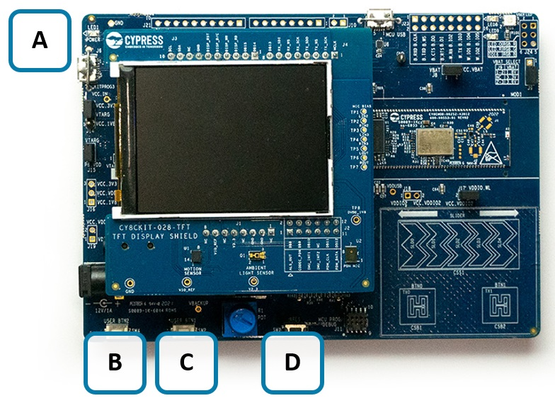
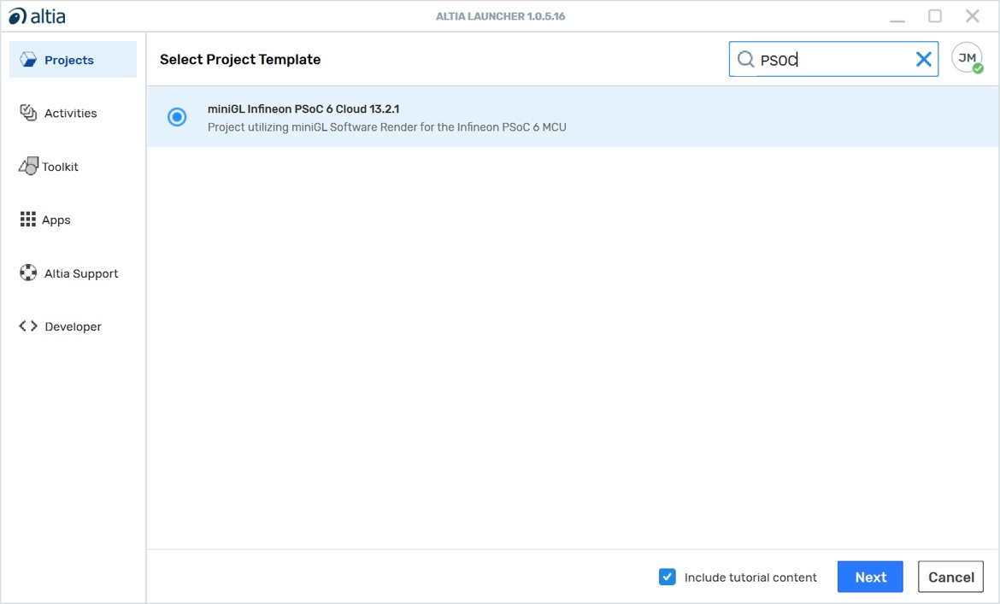
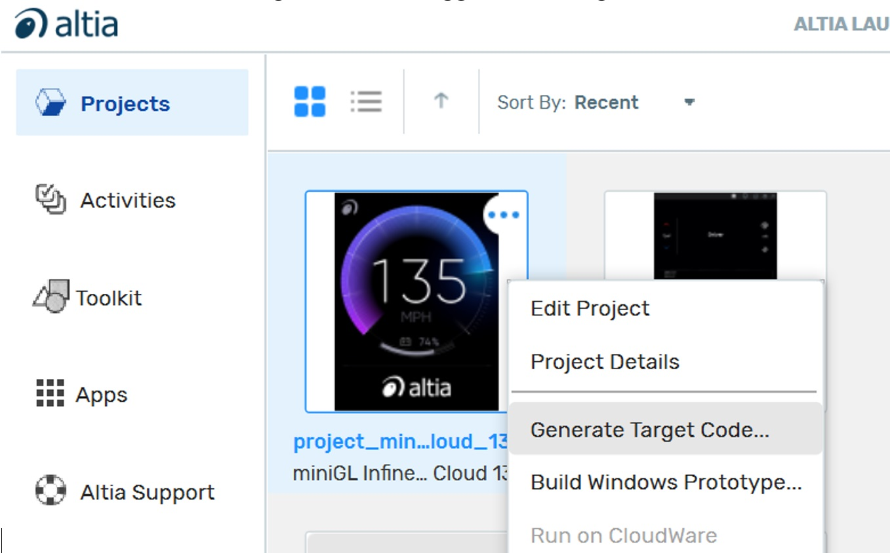
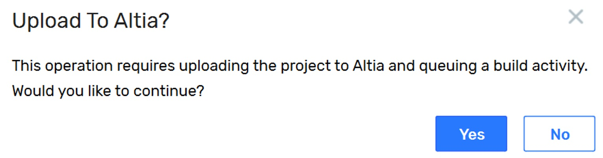
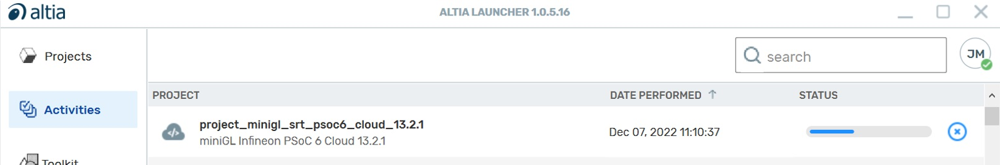
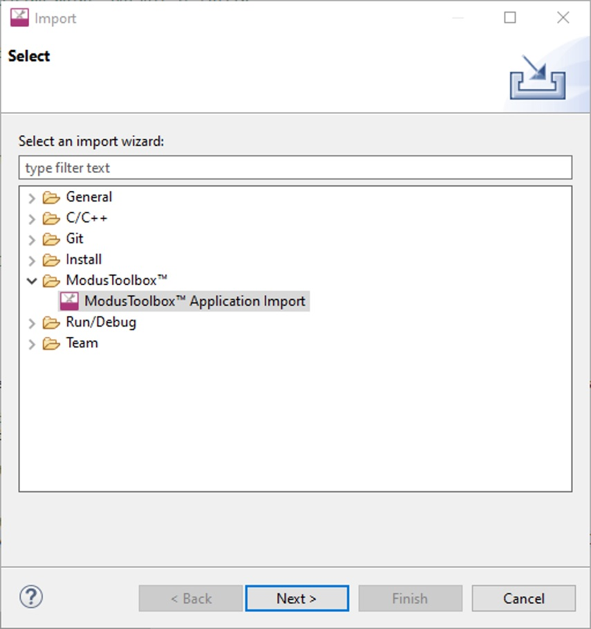
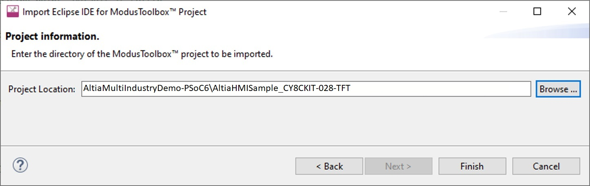
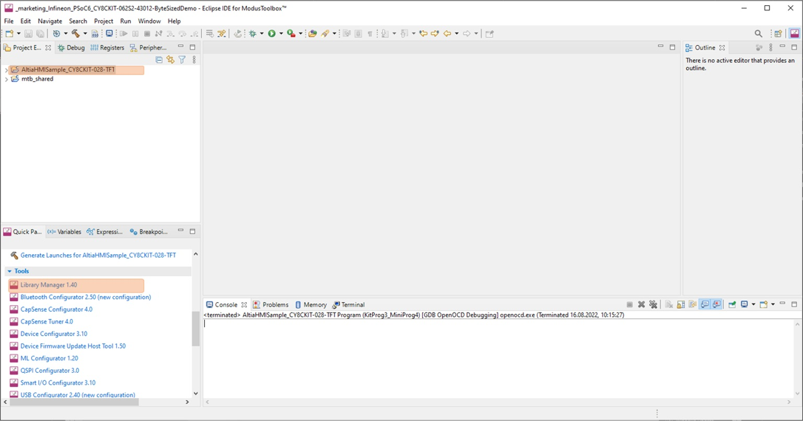
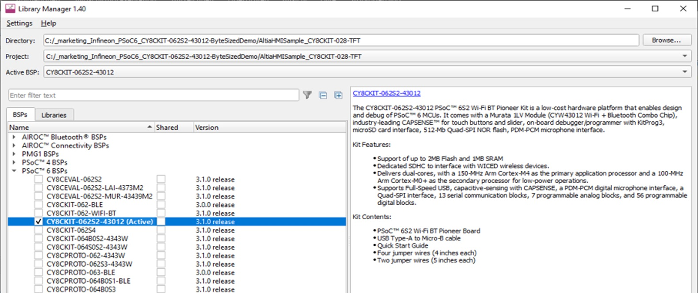
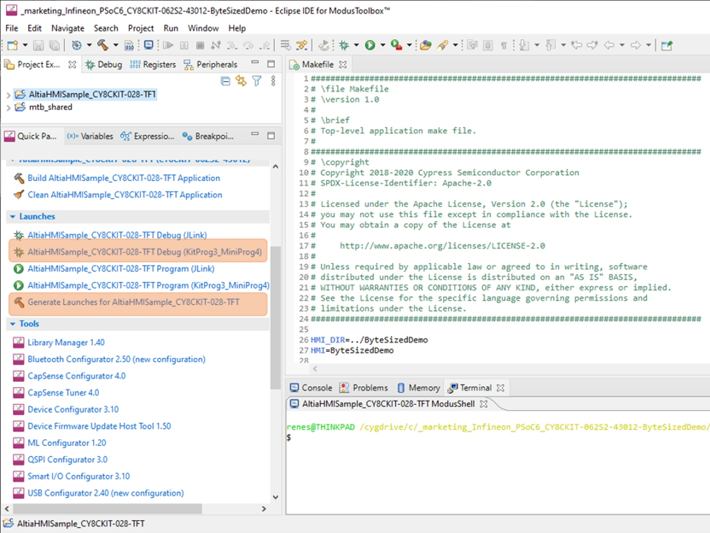

# Altia Multi-Industry Demo for PSOC 6
This readme describes the steps necessary to build Altia Multi-Industry Demo for Infineon PSoC 6 Evaluation Board, CY8CKIT-062S2-43012, utilizing CY8CKIT-028-TFT display.

## Requirements
- ModusToolbox™ software v2.2 or later (tested with v2.4)
- Board support package (BSP) minimum required version: 2.0.0
- Programming language: C
- Associated parts: All PSoC™ 6 MCU parts

### Supported Languages
- English

### Supported toolchains
- GNU Arm® embedded compiler v9.3.1 (GCC_ARM)

### Supported kits
- PSoC™ 62S2 Wi-Fi Bluetooth® pioneer kit (CY8CKIT-062S2-43012)

## Installation
For this demo, you need to:
1. Download and install ModusToolBox.
2. Request from support@altia.com to obtain Altia GUI design tool software.
3. Use the Altia invitation email to create your account.
4. After creation, download and install the Altia Launcher (available after account creation on our website).

## Demo System
- Board Required: [PSoC™ 6 EVB (CY8CKIT-062S2-43012)](https://www.infineon.com/cms/en/product/evaluation-boards/cy8ckit-062s2-43012)
- Operating System: No OS
- Display: [2.4” TFT 240x320 shield board (CY8CKIT-028-TFT)](https://www.infineon.com/cms/en/product/evaluation-boards/cy8ckit-028-tft)
- Rendering: Software Rendering

## Board Connection Setup
The image below shows the PSoC™ 6 evaluation board with the display shield mounted.

- **A** Micro-USB connector (J6) for debugging and flash programming
- **B** SW4 (USER BTN2)
- **C** SW2 (USER BTN1)
- **D** SW1 (XRES) Reset Button

## Build Altia Multi-Industry Demo via ModusToolBox
Below is the overview of two project components that are needed to build the Altia multi-industry demo via ModuToolbox IDE. Check out these two projects from GitHub and clone them into the local folder. The next sections describe how to build Altia HMI first from Altia Launch and then how to use ModusToolbox IDE to build the demo.

1. The Altia Project for the Infineon PSOC 6 platform.  See section (#Build Altia HMI from Altia Launcher)
2. The ModusToolBox Sample project (this repository)
  1. Built and tested with ModusTooBox v2.4.0
  1. The content of the AltiaHMISample_CY8CKIT-028-TFT folder must be imported as a project into the ModusToolBox IDE. After updating the ModusToolBox Libraries, the demo application can be built and deployed to the PSoC 6 evaluation board.
  1. The ModusToolBox sample project includes a linker-script incorporating the Altia BAM binary files and includes the required Altia DeepScreen miniGL target BSP functions.

## Build Altia HMI from Altia Launcher
1. From Altia Launcher window, click the “Create Project” button from the Project view.
2. Select the Infineon PSoC 6 configuration when creating the project. Make sure that “Include tutorial content” is checked then press the “Next” button:

3. A Save-As Dialog will appear.  Enter the name “ByteSizedDemo” for your new project and press Save.  Your new project will now appear in the Project View.
4. From the Project View, click the “…” button at the top right of the project image icon and select “Generate Target Code” to trigger the code generation:

5. Allow the upload of the project to Altia for code generation:

6. The progress of the code generation can be observed in the Activities View:

7. When the code generation is complete, download the results by clicking the download icon in the Activities View:

8. You will download the results later after setting up ModusToolBox

## Import ModusToolBox Project Integrated with Altia HMI
1. Launch ModusToolBox IDE
2. If given a prompt to input workspace select an area that is not in the same path as AltiaHMISample_CY8CKIT-028-TFT
3. From “File” menu, select “Import” function.
4. From import window, select “ModusToolbox” Application Import as shown below.

5. Import the contents of this 'AltiaHMISample_CY8CKIT-028-TFT' folder into the IDE as shown below.

6. After the project is imported, AltiaHMISample_CY8CKIT-028-TFT will show-up in the IDE Project Explorer as shown below. From there, use the “Quick Panel” tab to start “Library Manager” to generate the shared libraries needed for this project.

7. As shown below, CY8CKIY-06252-43012 (Active) under PSoC 6 BSPs shall be checked in the Library Manger window. After that, press the “Update” button to generate the library sources which will be stored in the mtb_shared folder.

8. Copy <repo file >/AltiaHMISample_CY8CKIT-028-TFT/ cy8c6xxa_cm4_dual.ld to AltiaHMISample_CY8CKIT-028-TFT\libs\TARGET_CY8CKIT-062S2-43012\COMPONENT_CM4\TOOLCHAIN_GCC_ARM\cy8c6xxa_cm4_dual.ld. This will override the existing file. This is required to link the Altia build to the project.
9. Create a folder at the same level as AltiaHMISample_CY8CKIT-028-TFT and name it “ByteSizedDemo”
10. Return to the Altia Launcher > Activities Tab. Select the download button for the design you build in the previous section. A Save-As Dialog will appear.  Pick the ByteSizedDemo folder you just created for the download.
11. A File Explorer window will open after the download is complete.  The following folders will be present:
  1. “log” folder – contains the logs from the code generation.
  1. “out” folder – contains the build artifacts (Altia libs, headers, and reflash assets).
12. Now in ModusToolBox, build the demo application by right-clicking the AltiaHMISample_CY8CKIT-028-TFT project and selecting “Build Project”. Alternatively, this building project process can be done by running “make getlibs” in the ModusToolBox Console.
13. When the application build process is finished successfully, the ELF-file of the application named AltiaHMISample_CY8CKIT-028-TFT.elf will be in AltiaHMISample_CY8CKIT-028-TFT/build/CY8CKIT-062S2-43012/(Debug|Release) folder. 

## Deploy Demo to PSoC 6 Evaluation Board via IDE
The demo executable can be programmed to PSoC 6 evaluation board via the ModusToolbox IDE using the corresponding Application Launcher. It is recommended to update the Launcher Configurations to match the current selected build-type (Debug/Release). This is done by running “Generate Launches for AltiaHIMSample_CY8CKIT-028-TFT” as shown below.
1. Connect the boards J6 USB port to the PC. USB port shown in the Board Connection Setup section of this document.

2. Select “AltiaHMISample_CY8CKIT-028-TFT Program (KitProg3_MiniProg4)” from the Quick Panel to deploy the demo to the board.

